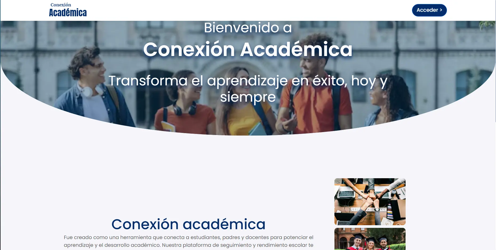
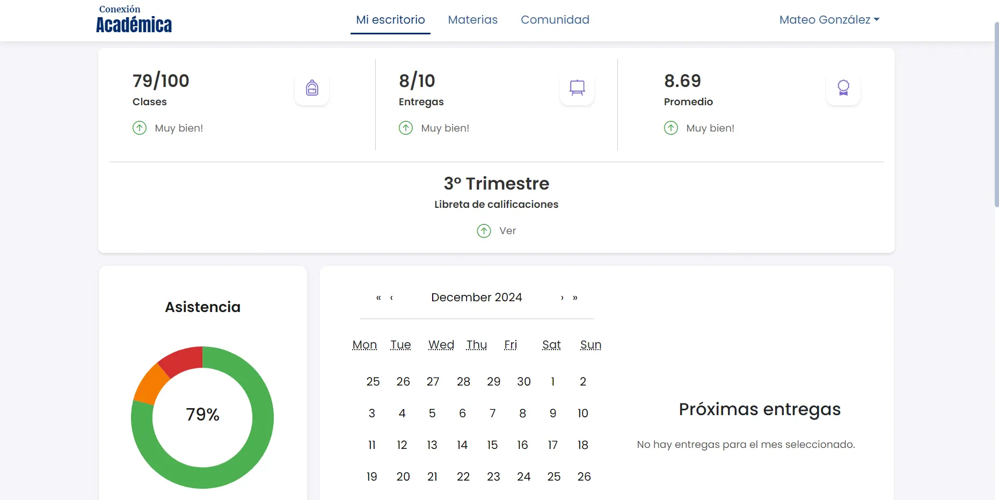
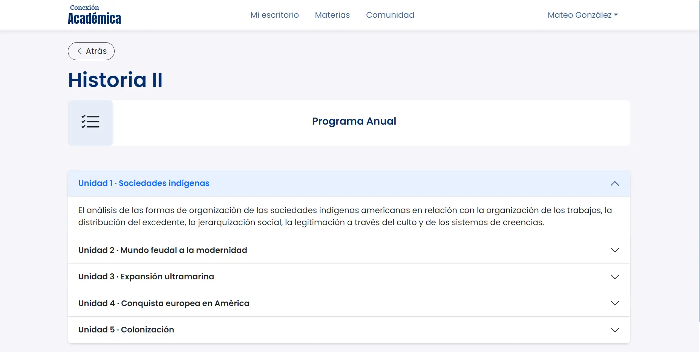
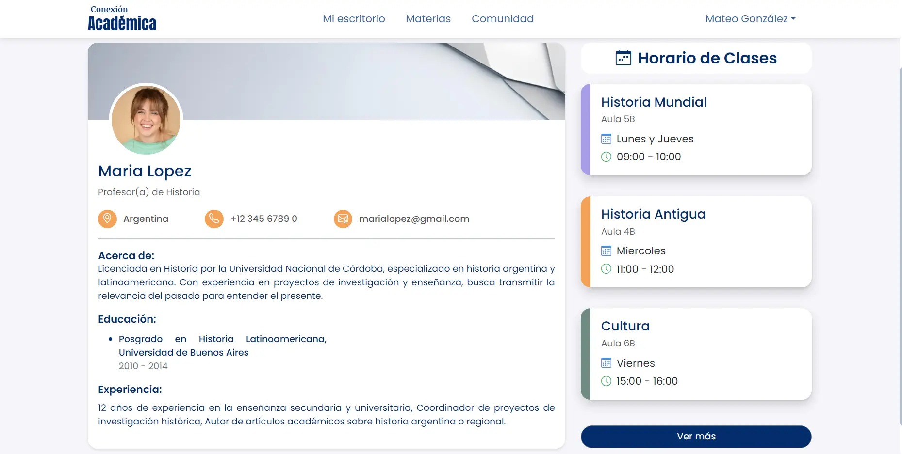
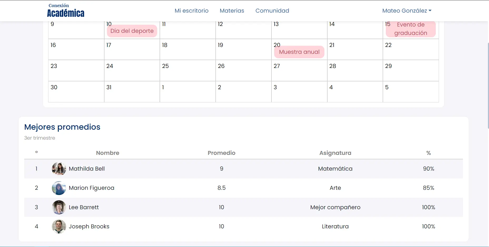

**Conexión Académica**  
Conexión Académica es una aplicación web diseñada para conectar estudiantes y padres de familia con colegios de nivel secundario. Nuestra plataforma facilita el monitoreo del progreso académico, fomenta el aprendizaje y destaca los logros educativos. Con herramientas sencillas y efectivas, permite identificar áreas de mejora y celebrar el desarrollo integral de los estudiantes.

**Equipo-c22-22-t-webapp**

* Camila Berlincourt: UX/UI designer  
* Maria Gabriela Fermin: QA tester   
* Leonardo Fuente Claros: Front-end   
* Hugo Gianpierre Salazar: Front-end  
* Juan Diego Elissalde Gudefín: Front-end

**Deploy**  
[https://conexion-academica.onrender.com](https://conexion-academica.onrender.com) 

**Credenciales**

* Estudiante A \- Mateo Gonzalez  
  DNI: 4278655  
  Gmail: 4278655@gmail.com  
  Contraseña: conexionacademica

* Estudiante B \- Emilia González  
  DNI: 4475431  
  Gmail:4475431@gmail.com  
  Contraseña: conexionacademica

**Figma**  
[https://www.figma.com/design/svkofHQcdejpKMtGpCQXMs/NoCountry?node-id=0-1\&t=YM8MN9dafONPKJ9n-1](https://www.figma.com/design/svkofHQcdejpKMtGpCQXMs/NoCountry?node-id=0-1&t=YM8MN9dafONPKJ9n-1)   
Contraseña: 

**Funcionalidades**  
Visualizar la lista de materias por año en las que el estudiante está inscrito.  
Visualizar …  
**Tecnología utilizadas**

* Frontend: React \+ ViteJs, Bootstrap5, Firebase Authentication  
* .

**Vista previa del proyecto**  
  
  

