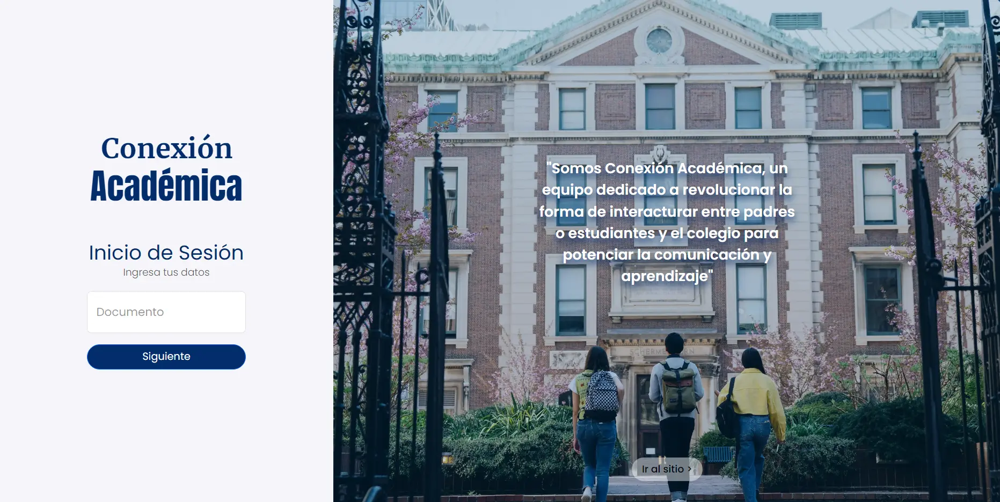
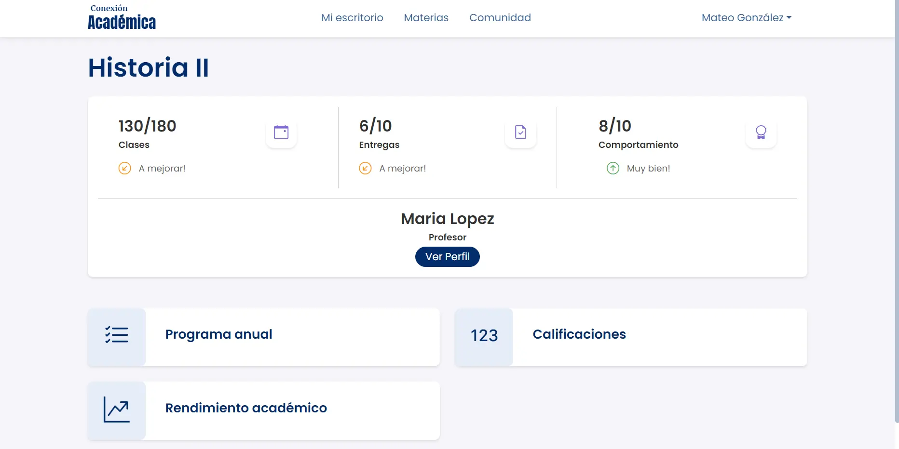
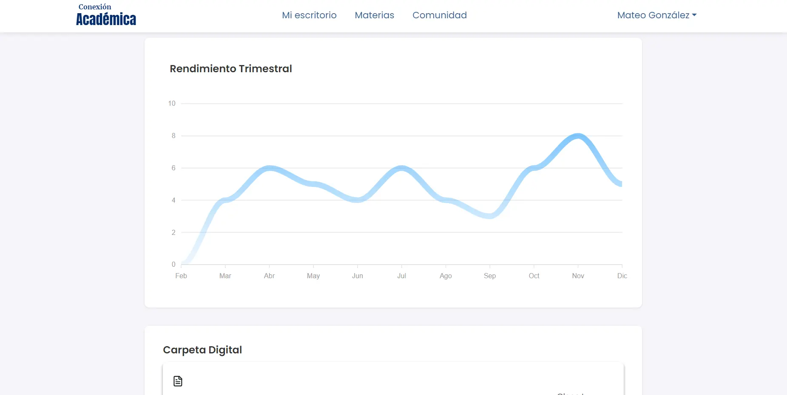

**Conexión Académica**  
Conexión Académica es una aplicación web diseñada para conectar estudiantes y padres de familia con colegios de nivel secundario. Nuestra plataforma facilita el monitoreo del progreso académico, fomenta el aprendizaje y destaca los logros educativos. Con herramientas sencillas y efectivas, permite identificar áreas de mejora y celebrar el desarrollo integral de los estudiantes.

**Equipo-c22-22-t-webapp**

* Camila Berlincourt: UX/UI designer  
* Ayelén Ferreyra: UX/UI designer  
* Maria Gabriela Fermin: QA tester  
* Kevin Rodallega: QA Tester.  
* Leonardo Fuente Claros: Front-end   
* Juan Diego Elissalde Gudefín: Front-end  
* Violeta Hours: Team Leader

**Deploy**  
[https://conexion-academica.onrender.com](https://conexion-academica.onrender.com) 

**Credenciales**

* Estudiante A \- Mateo Gonzalez  
  DNI: 4278655  
  Gmail: 4278655@gmail.com  
  Contraseña: conexionacademica

* Estudiante B \- Emilia González  
  DNI: 4475431  
  Gmail:4475431@gmail.com  
  Contraseña: conexionacademica

**Figma**  
[https://www.figma.com/design/svkofHQcdejpKMtGpCQXMs/NoCountry?node-id=0-1\&t=KkRd3rFULeHyJoPe-1](https://www.figma.com/design/svkofHQcdejpKMtGpCQXMs/NoCountry?node-id=0-1&t=KkRd3rFULeHyJoPe-1)  

**QA:** [https://drive.google.com/drive/folders/1--RcWsXft-J7dZ7tnq6ePXjSTyBAKHfl](https://drive.google.com/drive/folders/1--RcWsXft-J7dZ7tnq6ePXjSTyBAKHfl)

**Funcionalidades**

* Visualizar información básica sobre el proyecto, a quien está dirigido.  
* Visualizar el rendimiento escolar de forma anual, trimestral específico por cada materia y por unidades de acuerdo al programa anual.  
* Visualizar cuantas asistencias, ausencias o tardanzas.  
* Visualizar la lista de materias por año en las que el estudiante está inscrito.  
* Visualizar el perfil de cada uno de los profesores asignados.  
* Podrá descargar archivos de PDF con información para trabajar en cada asignatura.  
* Tendrá acceso a herramientas digitales que le sirvan de ayuda a la hora de estudiar.  
* Visualizar su libreta de calificaciones, feedback del docente, notas de exámenes y próximas entregas.  
* Visualizar comunidad escolar donde el establecimiento brindará información sobre próximos eventos, mejores promedios y quienes serán elegidos para ser abanderados.

**Tecnología utilizadas**

* Frontend: React \+ ViteJs, Bootstrap5, Firebase Authentication  
* UX/UI: Figma  
* QA: Jira \- Zephyr Squad, Selenium

**Vista previa del proyecto**  
  
  

